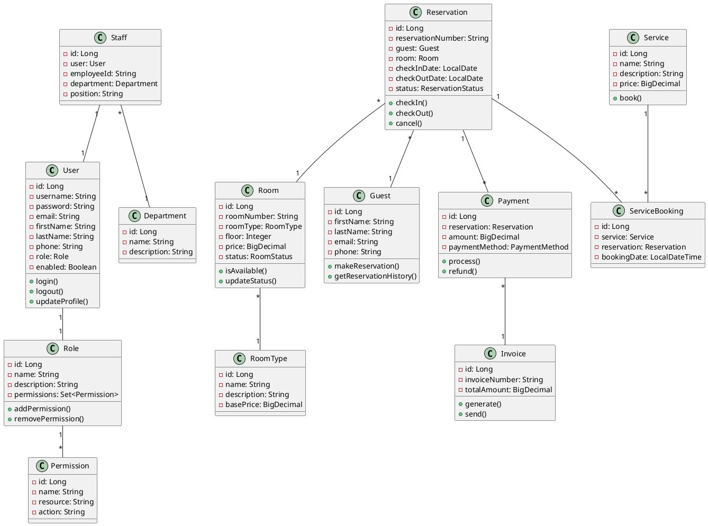

# Diagramme de Classes UML - Hotel Management System

## Description
Ce document présente le diagramme de classes UML pour le système de gestion hôtelière.

## Classes Principales

### 1. User (Utilisateur)
```
+---------------------------+
|         User              |
+---------------------------+
| - id: Long               |
| - username: String       |
| - password: String       |
| - email: String          |
| - firstName: String      |
| - lastName: String       |
| - phone: String          |
| - role: Role             |
| - enabled: Boolean       |
| - createdAt: LocalDateTime|
| - updatedAt: LocalDateTime|
+---------------------------+
| + login()                |
| + logout()               |
| + updateProfile()        |
| + changePassword()       |
+---------------------------+
```

### 2. Role (Rôle)
```
+---------------------------+
|         Role              |
+---------------------------+
| - id: Long               |
| - name: String           |
| - description: String    |
| - permissions: Set<Permission>|
+---------------------------+
| + addPermission()        |
| + removePermission()     |
| + hasPermission()        |
+---------------------------+
```

### 3. Permission
```
+---------------------------+
|      Permission           |
+---------------------------+
| - id: Long               |
| - name: String           |
| - resource: String       |
| - action: String         |
+---------------------------+
```

### 4. Room (Chambre)
```
+---------------------------+
|          Room             |
+---------------------------+
| - id: Long               |
| - roomNumber: String     |
| - roomType: RoomType     |
| - floor: Integer         |
| - price: BigDecimal      |
| - status: RoomStatus     |
| - maxOccupancy: Integer  |
| - description: String    |
| - amenities: List<String>|
| - images: List<String>   |
| - createdAt: LocalDateTime|
| - updatedAt: LocalDateTime|
+---------------------------+
| + isAvailable()          |
| + updateStatus()         |
| + calculatePrice()       |
+---------------------------+
```

### 5. RoomType (Type de Chambre)
```
+---------------------------+
|       RoomType            |
+---------------------------+
| - id: Long               |
| - name: String           |
| - description: String    |
| - basePrice: BigDecimal  |
| - capacity: Integer      |
| - rooms: List<Room>      |
+---------------------------+
| + addRoom()              |
| + removeRoom()           |
+---------------------------+
```

### 6. Reservation (Réservation)
```
+---------------------------+
|      Reservation          |
+---------------------------+
| - id: Long               |
| - reservationNumber: String|
| - guest: Guest           |
| - room: Room             |
| - checkInDate: LocalDate |
| - checkOutDate: LocalDate|
| - numberOfGuests: Integer|
| - status: ReservationStatus|
| - totalAmount: BigDecimal|
| - specialRequests: String|
| - createdAt: LocalDateTime|
| - updatedAt: LocalDateTime|
+---------------------------+
| + checkIn()              |
| + checkOut()             |
| + cancel()               |
| + modify()               |
| + calculateTotal()       |
+---------------------------+
```

### 7. Guest (Client)
```
+---------------------------+
|         Guest             |
+---------------------------+
| - id: Long               |
| - firstName: String      |
| - lastName: String       |
| - email: String          |
| - phone: String          |
| - address: String        |
| - city: String           |
| - country: String        |
| - documentType: String   |
| - documentNumber: String |
| - dateOfBirth: LocalDate |
| - reservations: List<Reservation>|
| - preferences: String    |
| - createdAt: LocalDateTime|
+---------------------------+
| + makeReservation()      |
| + cancelReservation()    |
| + updateProfile()        |
| + getReservationHistory()|
+---------------------------+
```

### 8. Staff (Personnel)
```
+---------------------------+
|         Staff             |
+---------------------------+
| - id: Long               |
| - user: User             |
| - employeeId: String     |
| - department: Department |
| - position: String       |
| - salary: BigDecimal     |
| - hireDate: LocalDate    |
| - schedule: List<Schedule>|
+---------------------------+
| + assignTask()           |
| + updateSchedule()       |
| + requestLeave()         |
+---------------------------+
```

### 9. Department (Département)
```
+---------------------------+
|       Department          |
+---------------------------+
| - id: Long               |
| - name: String           |
| - description: String    |
| - manager: Staff         |
| - staff: List<Staff>     |
+---------------------------+
| + addStaff()             |
| + removeStaff()          |
+---------------------------+
```

### 10. Service (Service Hôtel)
```
+---------------------------+
|        Service            |
+---------------------------+
| - id: Long               |
| - name: String           |
| - description: String    |
| - price: BigDecimal      |
| - category: ServiceCategory|
| - available: Boolean     |
| - duration: Integer      |
+---------------------------+
| + book()                 |
| + cancel()               |
+---------------------------+
```

### 11. ServiceBooking (Réservation de Service)
```
+---------------------------+
|    ServiceBooking         |
+---------------------------+
| - id: Long               |
| - service: Service       |
| - reservation: Reservation|
| - bookingDate: LocalDateTime|
| - status: BookingStatus  |
| - quantity: Integer      |
| - totalPrice: BigDecimal |
+---------------------------+
| + confirm()              |
| + cancel()               |
+---------------------------+
```

### 12. Payment (Paiement)
```
+---------------------------+
|        Payment            |
+---------------------------+
| - id: Long               |
| - reservation: Reservation|
| - amount: BigDecimal     |
| - paymentMethod: PaymentMethod|
| - paymentDate: LocalDateTime|
| - status: PaymentStatus  |
| - transactionId: String  |
| - invoice: Invoice       |
+---------------------------+
| + process()              |
| + refund()               |
| + generateInvoice()      |
+---------------------------+
```

### 13. Invoice (Facture)
```
+---------------------------+
|        Invoice            |
+---------------------------+
| - id: Long               |
| - invoiceNumber: String  |
| - reservation: Reservation|
| - payments: List<Payment>|
| - totalAmount: BigDecimal|
| - tax: BigDecimal        |
| - discount: BigDecimal   |
| - issueDate: LocalDateTime|
| - dueDate: LocalDateTime |
| - status: InvoiceStatus  |
+---------------------------+
| + generate()             |
| + send()                 |
| + markPaid()             |
+---------------------------+
```

## Énumérations

### RoomStatus
```
- AVAILABLE
- OCCUPIED
- MAINTENANCE
- RESERVED
- CLEANING
```

### ReservationStatus
```
- PENDING
- CONFIRMED
- CHECKED_IN
- CHECKED_OUT
- CANCELLED
- NO_SHOW
```

### PaymentMethod
```
- CASH
- CREDIT_CARD
- DEBIT_CARD
- BANK_TRANSFER
- MOBILE_PAYMENT
```

### PaymentStatus
```
- PENDING
- COMPLETED
- FAILED
- REFUNDED
```

### ServiceCategory
```
- RESTAURANT
- SPA
- LAUNDRY
- ROOM_SERVICE
- TRANSPORT
- CONFERENCE
```

## Relations

1. **User - Role**: Many-to-One (Un utilisateur a un rôle)
2. **Role - Permission**: Many-to-Many (Un rôle a plusieurs permissions)
3. **Room - RoomType**: Many-to-One (Une chambre a un type)
4. **Reservation - Guest**: Many-to-One (Une réservation appartient à un client)
5. **Reservation - Room**: Many-to-One (Une réservation concerne une chambre)
6. **Reservation - Payment**: One-to-Many (Une réservation peut avoir plusieurs paiements)
7. **Reservation - ServiceBooking**: One-to-Many (Une réservation peut avoir plusieurs services)
8. **Staff - User**: One-to-One (Un employé est lié à un utilisateur)
9. **Staff - Department**: Many-to-One (Un employé appartient à un département)
10. **Service - ServiceBooking**: One-to-Many (Un service peut avoir plusieurs réservations)
11. **Payment - Invoice**: Many-to-One (Plusieurs paiements peuvent appartenir à une facture)

## Diagramme Visuel (PlantUML)


