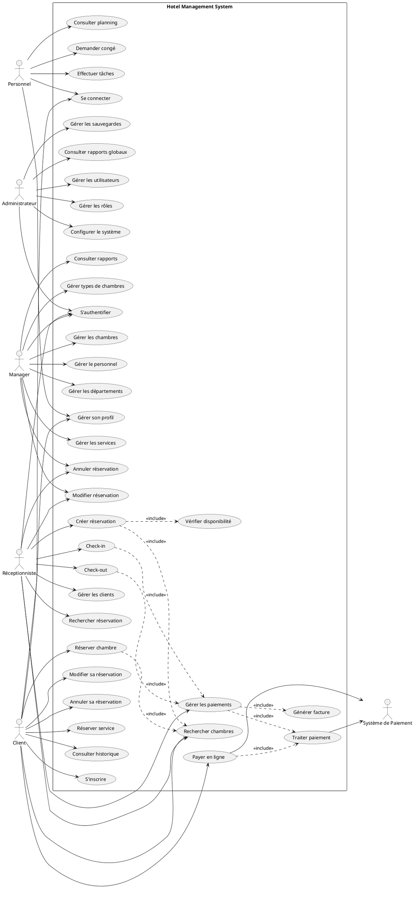

# Diagramme de Cas d'Utilisation UML - Hotel Management System

## Description
Ce document présente les cas d'utilisation du système de gestion hôtelière pour différents acteurs.

## Acteurs

### 1. Administrateur (Admin)
Responsable de la gestion globale du système

### 2. Manager (Gestionnaire)
Gère les opérations quotidiennes de l'hôtel

### 3. Réceptionniste (Receptionist)
Gère les réservations et l'accueil des clients

### 4. Client (Guest)
Utilisateur final qui réserve des chambres

### 5. Personnel (Staff)
Employés de l'hôtel

### 6. Système de Paiement (Payment System)
Système externe pour le traitement des paiements

## Cas d'Utilisation par Acteur

### Administrateur
1. **Gérer les utilisateurs**
   - Créer un utilisateur
   - Modifier un utilisateur
   - Supprimer un utilisateur
   - Attribuer des rôles
   - Gérer les permissions

2. **Gérer les rôles et permissions**
   - Créer des rôles
   - Attribuer des permissions
   - Modifier les rôles

3. **Configurer le système**
   - Paramètres généraux
   - Tarification
   - Politiques de l'hôtel

4. **Gérer les sauvegardes**
   - Créer une sauvegarde
   - Restaurer une sauvegarde
   - Planifier des sauvegardes automatiques

5. **Consulter les rapports globaux**
   - Rapports financiers
   - Statistiques d'occupation
   - Performance du personnel

### Manager
1. **Gérer les chambres**
   - Ajouter une chambre
   - Modifier une chambre
   - Supprimer une chambre
   - Changer le statut d'une chambre
   - Définir les tarifs

2. **Gérer les types de chambres**
   - Créer un type de chambre
   - Modifier un type de chambre
   - Définir les caractéristiques

3. **Gérer le personnel**
   - Ajouter un employé
   - Modifier les informations d'un employé
   - Gérer les plannings
   - Attribuer des départements

4. **Gérer les départements**
   - Créer un département
   - Modifier un département
   - Assigner un responsable

5. **Gérer les services**
   - Ajouter un service
   - Modifier un service
   - Définir les prix
   - Activer/Désactiver un service

6. **Consulter les rapports**
   - Taux d'occupation
   - Revenus par période
   - Performance des chambres
   - Statistiques des services

7. **Gérer les réservations**
   - Modifier une réservation
   - Annuler une réservation
   - Surclasser une réservation

### Réceptionniste
1. **Gérer les réservations**
   - Créer une réservation
   - Modifier une réservation
   - Annuler une réservation
   - Rechercher une réservation
   - Confirmer une réservation

2. **Check-in/Check-out**
   - Effectuer un check-in
   - Effectuer un check-out
   - Vérifier les documents
   - Attribuer une chambre

3. **Gérer les clients**
   - Créer un profil client
   - Modifier un profil client
   - Consulter l'historique client
   - Rechercher un client

4. **Gérer les paiements**
   - Enregistrer un paiement
   - Générer une facture
   - Traiter un remboursement

5. **Réserver des services**
   - Ajouter un service à une réservation
   - Modifier une réservation de service
   - Annuler une réservation de service

6. **Gérer la disponibilité des chambres**
   - Consulter la disponibilité
   - Bloquer une chambre
   - Libérer une chambre

### Client (Guest)
1. **S'authentifier**
   - S'inscrire
   - Se connecter
   - Réinitialiser le mot de passe

2. **Gérer son profil**
   - Modifier ses informations personnelles
   - Gérer ses préférences
   - Consulter son historique

3. **Réserver une chambre**
   - Rechercher des chambres disponibles
   - Sélectionner une chambre
   - Effectuer une réservation
   - Modifier une réservation
   - Annuler une réservation

4. **Réserver des services**
   - Consulter les services disponibles
   - Réserver un service
   - Annuler une réservation de service

5. **Gérer les paiements**
   - Effectuer un paiement en ligne
   - Consulter les factures
   - Télécharger les reçus

6. **Consulter les informations**
   - Voir ses réservations actives
   - Consulter l'historique des réservations
   - Voir les détails de l'hôtel

### Personnel (Staff)
1. **S'authentifier**
   - Se connecter
   - Changer son mot de passe

2. **Gérer son profil**
   - Consulter ses informations
   - Modifier son profil

3. **Consulter son planning**
   - Voir ses horaires
   - Demander un congé

4. **Effectuer des tâches assignées**
   - Marquer les tâches comme complétées
   - Ajouter des commentaires

## Diagramme Visuel (PlantUML)

## Description Détaillée des Cas d'Utilisation Principaux

### UC12: Créer une réservation
**Acteur principal**: Réceptionniste  
**Préconditions**: L'utilisateur est authentifié  
**Postconditions**: Une nouvelle réservation est créée dans le système

**Flux principal**:
1. Le réceptionniste recherche les chambres disponibles
2. Le système affiche les chambres disponibles selon les critères
3. Le réceptionniste sélectionne une chambre
4. Le réceptionniste entre les informations du client
5. Le réceptionniste définit les dates de séjour
6. Le système calcule le montant total
7. Le réceptionniste confirme la réservation
8. Le système génère un numéro de réservation

**Flux alternatif**:
- Si aucune chambre n'est disponible, proposer des dates alternatives
- Si le client existe déjà, récupérer ses informations

### UC15: Check-in
**Acteur principal**: Réceptionniste  
**Préconditions**: Une réservation confirmée existe  
**Postconditions**: Le client est enregistré comme présent

**Flux principal**:
1. Le réceptionniste recherche la réservation
2. Le système affiche les détails de la réservation
3. Le réceptionniste vérifie les documents du client
4. Le réceptionniste attribue une chambre si non attribuée
5. Le système met à jour le statut de la réservation
6. Le système met à jour le statut de la chambre
7. Le réceptionniste remet les clés au client

### UC22: Réserver une chambre (Client)
**Acteur principal**: Client  
**Préconditions**: Le client est inscrit et connecté  
**Postconditions**: Une demande de réservation est créée

**Flux principal**:
1. Le client recherche des chambres disponibles
2. Le système affiche les chambres avec photos et tarifs
3. Le client sélectionne une chambre
4. Le client entre les dates de séjour
5. Le système calcule le prix total
6. Le client confirme la réservation
7. Le client effectue le paiement
8. Le système envoie une confirmation par email

## Scénarios d'Utilisation

### Scénario 1: Réservation complète
1. Un client visite le site web
2. Recherche des chambres pour des dates spécifiques
3. Sélectionne une chambre Standard pour 2 nuits
4. Ajoute le service petit-déjeuner
5. Effectue le paiement en ligne
6. Reçoit une confirmation par email

### Scénario 2: Check-in à la réception
1. Un client arrive à l'hôtel
2. Le réceptionniste recherche la réservation
3. Vérifie l'identité du client
4. Attribue la chambre 205
5. Demande un paiement de caution
6. Génère une carte-clé
7. Remet la clé au client

### Scénario 3: Gestion quotidienne par le Manager
1. Le manager se connecte le matin
2. Consulte le tableau de bord
3. Vérifie le taux d'occupation
4. Ajuste les tarifs pour la semaine suivante
5. Examine les réservations du jour
6. Assigne les tâches au personnel
7. Consulte les rapports de revenus
